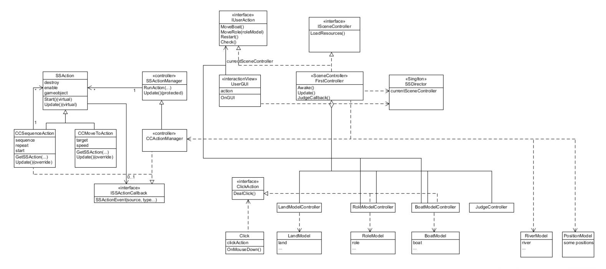

# priest_and_demon
## uml图

## 实验主要目的：裁判类的制作
将“裁判类”与其他模块分开，目的是提升代码的模块化和条理性。裁判类一般承担规则判定和比赛结果裁定等逻辑控制功能，适合独立于其他模块，以确保结构清晰、职责明确、易于维护。

分离方法包括：

- **职责划分**：裁判类专注于规则判定，其他模块负责游戏角色、状态等功能，各司其职，便于管理。
- **文件结构**：将裁判类置于独立文件夹或文件中，使项目结构一目了然，方便快速定位代码。
- **接口与继承**：通过接口或继承方式独立裁判逻辑，增强模块间解耦，便于裁判规则的复用与扩展。
- **便于测试**：裁判类与其他模块分开有助于独立测试与优化，确保规则更新时不会影响其他模块。

这样分离裁判类，能保证代码在规模增大时依然保持简洁和可维护性。

在uml图中也可以看见就是其中的judgecontroller类也就是裁判类，这样更利于代码的维护!
## prefab制作
Prefab（预制件）是一种常见的游戏开发概念，通常用于 Unity 或类似的引擎中。它是一个可以**重复使用的游戏对象模板**，包含一组预定义的属性、组件和子对象，便于开发者在不同场景中复用相同的对象而无需重复配置。Prefab 制作可以有效提高开发效率，确保一致性。

### Prefab 制作步骤概述

1. **创建对象**：在场景中创建一个游戏对象，可以是简单的形状（如立方体、球体）或是包含多个组件的复杂对象，如角色、道具等。

2. **配置属性与组件**：根据需要，为对象添加各种组件（如渲染器、碰撞器、物理属性等），并设置好它的初始属性，如位置、颜色、动画等。

3. **转为 Prefab**：将配置好的对象拖动到项目窗口中的“Prefab”文件夹内，即可生成一个 Prefab 文件。此文件即为对象的模板，保存了对象的所有属性。

4. **使用 Prefab**：可以在场景中多次实例化此 Prefab，通过拖拽 Prefab 文件或编程方式来生成多个实例，所有实例都共享同一个模板设置。

5. **修改与更新**：当需要对 Prefab 进行调整时，可以双击 Prefab 文件进入编辑模式，对属性和组件进行修改。修改会自动应用到所有实例上，确保一致性。

### Prefab 的优点

- **复用性**：Prefab 是可复用的模板，适用于多种场景，节省开发时间。
- **一致性**：修改 Prefab 后会同步更新到所有实例，保持一致性。
- **动态生成**：可在运行时通过代码创建、销毁 Prefab 实例，实现动态化游戏内容。

通过合理使用 Prefab，开发者可以有效简化流程并确保项目的灵活性和一致性。
## 天空盒制作
可以按照以下步骤进行自定义天空盒的制作和设置：

### 1. 下载并导入天空盒资源包
- 使用 Unity 的 Asset Store 搜索 `Fantasy Skybox FREE`。
- 添加资源到账户并打开 Unity Editor 中的 Package Manager。
- 下载并导入资源包，完成后 `Fantasy Skybox FREE` 目录会出现在项目中。

### 2. 查看和理解天空盒材质

打开以下文件，了解不同类型的天空盒材质：
- **Cubemap 类型**（立方体贴图）： `Assets > Fantasy Skybox FREE > Cubemaps > Classic > FS000_Day_01.mat`
  - **Shader 名称**：`Skybox/Cubemap`
  - **参数**：Cubemap 是一张全景的圆形图片，Inspector 面板会显示圆形的 Cubemap 图片。
  
- **6 面贴图类型**：`Assets > Fantasy Skybox FREE > Cubemaps > FS002 > FS002_Day_Cubemap.mat`
  - **Shader 名称**：`Mobile/Skybox`
  - **参数**：包含 6 张贴图，每张代表一个面的图片。
  
- **Panoramic 类型**：`Assets > Fantasy Skybox FREE > Panoramics > FS002 > FS002_Day.mat`
  - **Shader 名称**：`Skybox/Panoramic`
  - **参数**：此类型材质使用一张全景图（Spherical）作为背景。

### 3. 自定义天空盒材质

1. 在 `Assets` 目录中右键选择 **Create > Material** 创建一个新的材质，并命名为 `mysky`。
2. 在 **Inspector** 中设置 `Shader` 为 `Skybox` 类型的三种之一，例如 `Skybox/6 Sided`。
3. 根据 `Shader` 类型，将合适的图片拖入 `Inspector` 中的参数栏：

   - **Cubemap 类型**：将 Cubemap 图片拖入 `Cubemap` 参数。
   - **6 面贴图类型**：分别将六个方向的图片（正面、背面、左侧、右侧、顶部、底部）拖入对应位置。
   - **Panoramic 类型**：将全景图拖入 `Spherical` 参数。

4. 在 `Inspector` 中调整材质的亮度、颜色、对比度等渲染配置，使天空盒与场景效果契合。

### 4. 应用天空盒材质到场景

- 打开 Unity 的 **Lighting** 设置（Window > Rendering > Lighting）窗口。
- 在 `Environment` 选项中，将 `mysky` 材质拖到 `Skybox Material` 中。
  
这样，天空盒就成功应用到场景中并生效了。

## code

### 裁判类
这个类是本次实验的关键！
`JudgeController` 脚本用于游戏中状态的判断，负责检测胜利和失败条件。以下是对该脚本的简要说明：

### 概述
`JudgeController` 控制游戏中的胜负判定逻辑，检测游戏状态和角色数量，并更新游戏消息。

### 主要部分

1. **变量声明**
   - `mainController`：指向主控制器，管理游戏的整体状态。
   - `leftLandModel` 和 `rightLandModel`：分别表示左右两边的土地模型，包含角色数量。
   - `boatModel`：表示船的状态，包括船上的角色数量。

2. **Start 方法**
   - 初始化 `mainController`、`leftLandModel`、`rightLandModel` 和 `boatModel`，获取当前场景的控制器和模型数据。

3. **Update 方法**
   - 检查游戏是否在运行。
   - 判断时间是否结束，如果结束则调用 `JudgeCallback` 方法，显示 "Game Over!"。
   - 检查是否胜利，如果右侧的牧师数量达到 3，则调用 `JudgeCallback`，显示 "You Win!"。
   - 检查失败条件：如果任一侧的牧师数量不为 0 且少于恶魔数量，则游戏失败，调用 `JudgeCallback` 显示 "Game Over!"。

通过这些逻辑，该脚本有效地判断游戏的胜负情况，并通过回调函数更新游戏状态。
```
using System.Collections;
using System.Collections.Generic;
using UnityEngine;

public class JudgeController : MonoBehaviour
{
    public FirstController mainController;
    public LandModel leftLandModel;
    public LandModel rightLandModel;
    public BoatModel boatModel;
    // Start is called before the first frame update
    void Start()
    {
        mainController = (FirstController)SSDirector.GetInstance().CurrentSenceController;
        this.leftLandModel = mainController.leftLandController.GetLandModel();
        this.rightLandModel = mainController.rightLandController.GetLandModel();
        this.boatModel = mainController.boatController.GetBoatModel();
    }
    // Update is called once per frame
    void Update()
    {
        if (!mainController.isRuning)
            return;
        if (mainController.time <= 0)
        {
            mainController.JudgeCallback(false, "Game Over!");
            return;
        }
        this.gameObject.GetComponent<UserGUI>().gameMessage = "";
        //判断是否已经胜利
        if (rightLandModel.priestNum == 3)
        {
            mainController.JudgeCallback(false, "You Win!");
            return;
        }
        else
        {
            int leftPriestNum, leftDevilNum, rightPriestNum, rightDevilNum;
            leftPriestNum = leftLandModel.priestNum + (boatModel.isRight ? 0 : boatModel.priestNum);
            leftDevilNum = leftLandModel.devilNum + (boatModel.isRight ? 0 : boatModel.devilNum);
            if (leftPriestNum != 0 && leftPriestNum < leftDevilNum)
            {
                mainController.JudgeCallback(false, "Game Over!");
                return;
            }
            rightPriestNum = rightLandModel.priestNum + (boatModel.isRight ? boatModel.priestNum : 0);
            rightDevilNum = rightLandModel.devilNum + (boatModel.isRight ? boatModel.devilNum : 0);
            if (rightPriestNum != 0 && rightPriestNum < rightDevilNum)
            {
                mainController.JudgeCallback(false, "Game Over!");
                return;
            }
        }
    }
}
```
## Model类讲解
代码就不在这里放出了
在游戏开发和软件设计中，`Model` 类型通常用于表示游戏中的数据结构和状态，以下是其主要作用：

### 1. 数据封装
`Model` 类型负责存储和管理游戏的核心数据，如角色状态、游戏规则、资源数量等。通过封装，`Model` 提供了一个清晰的接口，使得数据的访问和修改变得更加规范。

### 2. 逻辑处理
`Model` 可以包含与游戏逻辑相关的方法，例如计算得分、判断胜负条件或更新角色状态。这使得数据与操作逻辑分离，提高了代码的可维护性。

### 3. 状态管理
在 MVC（模型-视图-控制器）架构中，`Model` 负责管理应用程序的状态，任何对状态的改变都需要通过 `Model` 进行更新，确保应用的状态是一致的。

### 4. 数据传输
`Model` 通常用于在不同模块之间传递数据。例如，在控制器（Controller）和视图（View）之间，`Model` 充当了数据的桥梁，使得不同部分能够协同工作而不直接相互依赖。

### 5. 可扩展性
通过使用 `Model` 类型，可以方便地扩展游戏的功能或增加新的数据属性。例如，在添加新的游戏角色或道具时，只需修改相关的 `Model` 类，而不需要更改其他部分的代码。

### 总结
`Model` 类型在游戏开发中起着至关重要的作用，它不仅帮助管理和组织数据，还支持游戏逻辑、状态管理和数据传输，从而提高了代码的清晰度和可维护性。


